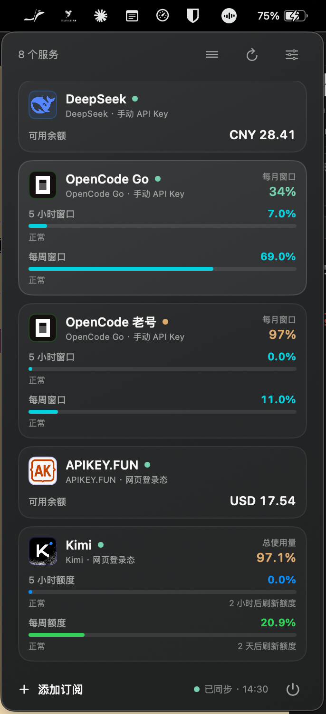

# TokenMeter

[简体中文](README.md) | **English**

> **AI usage and balance monitoring in your macOS menu bar.** Official subscription quota windows (Kimi, Claude Code, Codex, Zhipu GLM, DeepSeek, MiniMax, OpenCode Go) and third-party AI relay balances (CCBus, APIKEY.FUN, NowCoding, Siyu) in one panel: always-on background refresh, with low-balance and failed-auth notifications.




[](https://github.com/Amdeo/TokenMeter/actions/workflows/ci.yml)
[](https://github.com/Amdeo/TokenMeter/releases)

**Keywords**: macOS menu bar AI usage tracker · LLM quota and balance monitor · Claude Code / Codex / Kimi / DeepSeek usage · API relay balance · SwiftUI menu bar app · status bar app

## Why TokenMeter

- **Official plans and relays in one place**: 11 providers, so official subscription quota windows and third-party relay balances need one tool and one sign-in, not two.
- **Three authentication styles**: API key, OAuth (device flow / authorization code), and **browser session** — sign in once inside the embedded browser; no token copying and no plugins.
- **Quota windows and balances side by side**: 5-hour / weekly / monthly windows, plan quotas, and account balances rendered as provider-specific cards, with multiple accounts and drag-to-reorder.
- **Native**: Swift 6 + SwiftUI/AppKit with no third-party dependencies; lives in the menu bar and refreshes in the background, configurable from 60 seconds to 30 minutes.
- **Quiet notifications**: only low balances, failed authentication, and repeated service errors — never quota exhaustion or plan expiry noise.
- **Transparent and local**: no telemetry, no ads, no crash reporting; credentials stay in a private local file (directory `0700`, file `0600`), and an encrypted migration package is available.
- **Extensible**: a new provider is one folder under `Providers/Extensions/<id>/` plus one line in `ProviderCatalog` — see the [provider development guide](docs/provider-development.md).

## How it compares

Each project has its own focus (capabilities per each project's own description). TokenMeter's bet is one panel for both official quota and relay balances:

| Project | Focus | TokenMeter's approach |
| --- | --- | --- |
| [oh-myusage](https://github.com/Four-JJJJ/oh-myusage) | Menu bar summary of plan limits, relay balances, and local Codex accounts | Covers both data sources too, with an embedded browser login and encrypted credential migration on top |
| [token-remain](https://github.com/Carstin520/token-remain) | Privacy-first tracking of AI coding quotas and reset times | Reads balances alongside quota windows, including CCBus / APIKEY.FUN / NowCoding / Siyu relays |
| [Any-Api-Check](https://github.com/xiaopenghuang/Any-Api-Check) | Relay balances and call logs | Puts relay balances next to official quota on an always-on menu bar with low-balance notifications |
| [limit-monitor](https://github.com/DjentieY/limit-monitor) | Rate-limit windows for Claude / Codex / Cursor | Covers quota windows and balances for 11 providers, including Kimi, Zhipu, MiniMax, OpenCode Go, and browser sessions |

## Current capabilities

- Menu-bar overview of configured accounts' usage windows, usage, or balances; add, edit, delete, and reorder subscriptions. Right-click the menu-bar icon for the add-subscription, settings, and quit menu.
- Background refresh from 60 seconds to 30 minutes, with a two-minute default and an off switch.
- System notifications only for low balances, failed authentication, and repeated service errors. It does **not** alert on quota exhaustion, plan expiry, or subscription renewal.
- Settings for notification thresholds, launch at login, system/light/dark appearance, and an optional frosted-glass background in light mode.

The app UI is currently Simplified Chinese only; these docs are available in Chinese and English. There is no per-account refresh toggle. TokenMeter does not manage plan purchases or billing.

## Supported providers

| Provider | Data it can read | Authentication |
| --- | --- | --- |
| DeepSeek | Account balance | API key |
| Kimi | Coding usage windows/balance, depending on auth method | API key, Kimi Code OAuth, web session |
| Zhipu AI | GLM Coding Plan usage windows | API key |
| OpenCode Go | Usage windows | API key |
| MiniMax | Coding Plan quotas | API key |
| Claude | Pro/Max usage windows | Claude OAuth |
| OpenAI Codex | Codex usage windows | Codex device OAuth (experimental) |
| CCBus | Account balance | Web session |
| APIKEY.FUN | Account balance | Web session |
| NowCoding | Account balance and subscription quotas | Web session |
| Siyu API | Account balance and daily, weekly, and monthly plan quota windows | Web session |

Provider APIs and account permissions determine what can be displayed; TokenMeter does not guarantee that every account exposes every item. To add a provider, read the [provider development guide](docs/provider-development.md).

## Installation

### Published release

See [Releases](https://github.com/Amdeo/TokenMeter/releases) for the latest version. Every release is built by GitHub Actions and attaches a universal (Apple Silicon + Intel) `TokenMeter-<version>-macos-universal.zip` plus a matching `.sha256` checksum. It is an unsigned build: download it from the GitHub Release, unpack it, and follow macOS security prompts. The release and `main` are different: `main` contains development changes made after the release and is intended for users building from source.

The unsigned build has no Developer ID signature and is not notarized, so macOS blocks it on first launch:

1. Unpack the archive and move `TokenMeter.app` into `/Applications`.
2. In Finder, Control-click the app, choose **Open**, then choose **Open** again in the dialog; or open **System Settings → Privacy & Security** and choose **Open Anyway** for the blocked app.
3. If macOS reports the app is damaged, compare `shasum -a 256` against the `.sha256` asset from the same release first. When it matches, run `xattr -dr com.apple.quarantine /Applications/TokenMeter.app` and open the app again.

Download builds only from this repository's GitHub Release. Signing and notarization are documented in [CONTRIBUTING.md](CONTRIBUTING.md).

### Build from source

Use macOS 14 or later and Xcode 26 or later. The current development environment is:

| Item | Version |
| --- | --- |
| Development OS | macOS 26.5.2 (25F84) |
| Minimum OS | macOS 14.0 |
| macOS SDK (API) | 26.5 |
| Xcode | 26.6 (17F113) |
| Swift | Project 6.0, compiler 6.3.3 |

```bash
git clone https://github.com/Amdeo/TokenMeter.git
cd TokenMeter
open TokenMeter.xcodeproj
```

Select the `TokenMeter` scheme and run in Xcode. To build from the command line:

```bash
xcodebuild -project TokenMeter.xcodeproj -scheme TokenMeter \
  -configuration Debug build CODE_SIGNING_ALLOWED=NO
```

Running or distributing an unsigned source build may require your own Xcode Team and signing configuration. System notifications additionally require a build signed with an Apple developer certificate: macOS refuses to register an unsigned (linker/ad-hoc signed only) app for notifications. The app requests notification authorization once at launch (only when alerts are enabled and the system has not decided yet), and the settings panel reports any refusal reason.

## Get started

1. Click the TokenMeter menu-bar icon to open the overview; right-click it for the menu (add subscription, settings, quit).
2. Choose **Add subscription** from that menu, then choose a provider; the empty overview also has its own **Add subscription** button.
3. Complete that provider's API-key, OAuth, or web-login flow.
4. Return to the overview to see available data; adjust refresh and notification settings as needed.

Create API keys only through a provider's official interface. OAuth and web sessions are completed on the authorization page used by the app; see [SECURITY.md](SECURITY.md) for limits around experimental OAuth.

## Data and privacy

TokenMeter has no telemetry, crash-reporting, or advertising code, but it directly contacts the endpoints of providers that you configure. Review each provider's service and privacy terms before adding an account.

The app persistently stores the following on your Mac:

- `~/Library/Application Support/TokenMeter/credentials.json`: API keys, OAuth access/refresh tokens, or browser-login tokens/session cookies. This is **plaintext JSON**, not Keychain storage. On write, the app sets the directory to `0700` and file to `0600`; the macOS user and any local software able to read this file should still be treated as able to access the credentials.
- `~/Library/Application Support/TokenMeter/subscriptions.json`: subscription names, providers, authentication methods, enabled state, colors, and other metadata. It should not contain credentials.
- `UserDefaults`: refresh and notification preferences and thresholds, appearance, launch-at-login state, notification de-duplication records, and panel sizing.
- WebKit's default website-data store: sites used for embedded login can retain cookies, local storage, and other website data for later sign-in. The app can clear relevant site data when needed.

Do not publish these files, screenshots, logs, or browser exports. See [SECURITY.md](SECURITY.md) for security boundaries and reporting instructions.

## Development and contributing

The project uses Swift 6, SwiftUI, AppKit, ServiceManagement, and UserNotifications, with no third-party dependencies. The offline test requirement and contribution process are in [CONTRIBUTING.md](CONTRIBUTING.md); provider changes must also follow the [provider development guide](docs/provider-development.md). Public reports belong in GitHub Issues—never attach API keys, tokens, cookies, or a complete credential file.

## Sponsor

If TokenMeter saves you time, you can tip via WeChat Pay:


## License

[GPL-3.0](./LICENSE)
